## Project: Build a Traffic Sign Recognition Program

1. 	Introduction

In this project assignment [1] of Udacity's self-driving car Nanodegree, Tensorflow [2] and MATLAB [3] are used together to build a convolutional neural network for classifying traffic signs of German Traffic Sign Dataset [4]. The accuracy on the validation set is 95.6%, and the test accuracy is 94.4%. Based on the output of Softmax [5] function, five most easily confused figures are chosen from the Internet. The neural network recognizes four but makes a serious mistake on one.

2.	Preprocessing Dataset

The figures of traffic sign that are provided by Udacity are unevenly distributed between different types (Figure 1). Train, valid and test sets have same problem, which will worsen the training. However, they cannot be balanced because it will lead small samples. 

Figure 1

In the real word, one cannot expect the traffic sign stays at the middle of horizon; furthermore, the background will mislead the neural network. Self-driving cars should find where the sign is at the first place. Luckily, traffic signs are designed to have special color in appropriate light condition. So, the first job is to guess the illuminate condition of each figure [6]; then we balance the white so that they have right color (Figure 2). After that, we use the standard color to segment the figure which successfully finds half of traffic signs (17,805 successes VS. 16,994 failures in train database, Figure 3). The rest figures should have bad colors. Despite the color is error, the entire traffic sign should contain similar color. So, we class the rest figures with cluster analysis [7], which gives other 13,083 successes (Figure 4). The last 3911 failures are in serious condition. At last, The Marker-Controlled Watershed Segmentation [8] is used for gray-scale figures; however, there still have 3472 figures cannot be found traffic signs. These figures are supported to have a traffic sign at the middle of horizon. All masks are used in classification are circle, which will not mislead the train procedure. Entire procedure will inaccurately segment some figures (Figure 5).

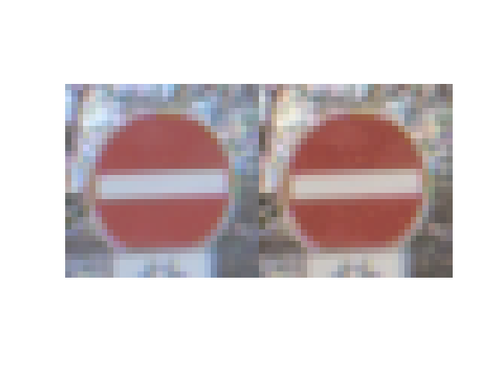

Figure 2: Before and After White Balance

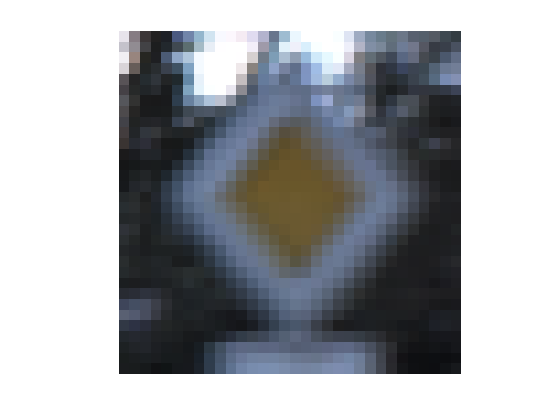

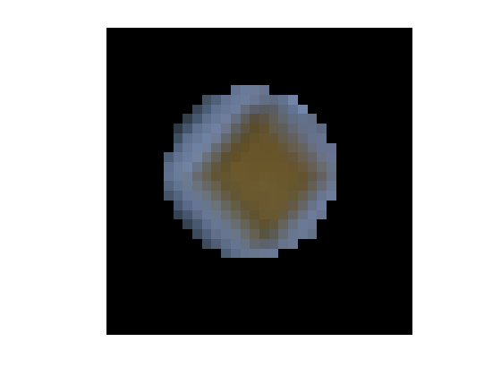

Figure 3: Before and After Color Segmentation (A)(B)

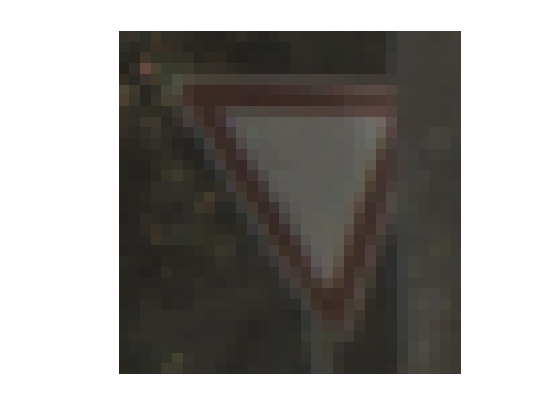

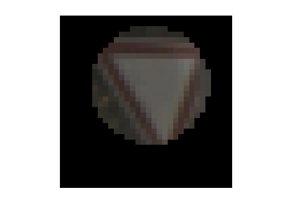

Figure 4: Before and After Cluster Based Segmentation (A)(B)

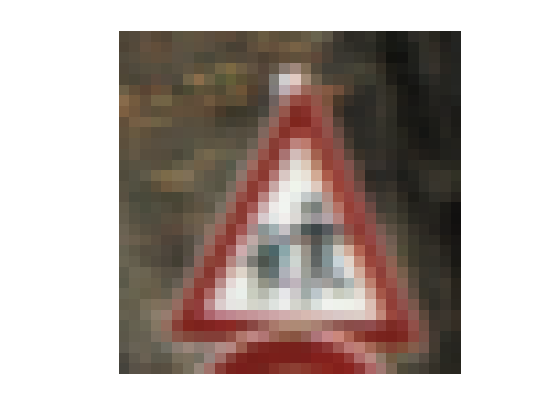

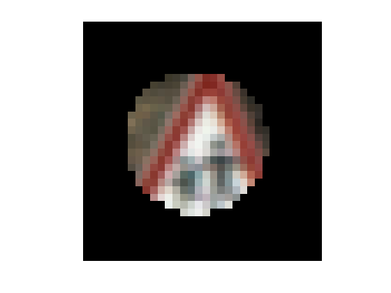

Figure 5: A Bad Segmentation (A)(B)

3.	Model Design
Based on the successful experience on MNIST [9] tasks, a filter with size 5*5*1*6 are used for gray-scale figures; then, a filter with size 5*5*3*9 are used for RGB figures for there are there kinds of colors. All these are combined to form 28*28*15 outputs, then they are down-sampled to 14*14*15 and filled in another convolutional layer with 10*10*27 outputs. These outputs are down-sampled again to 5*5*27. After three full-connected layers, which are 675*516, 516*362 and 362*43, they give logits. Active functions are all sigmoid. 

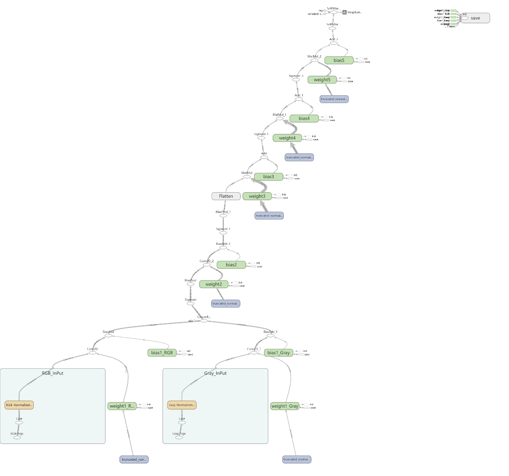

Figure 6: Data Flow Graph

4.	Training, Validating and Testing Model
The training procedure collects 128 samples at a time from the randomly shuffled database; then it minimizes the SoftMax cross entropy by Adam optimized (Figure 7). After all the samples are used, it calculates the accuracy on the validation set. This procedure repeats 41 times leads the validation accuracy reaches 95.6% (Figure 8). The test set is used once that gives the accuracy 94.4%. The average SoftMax for every class in test set is recorded. As we can see, the average SoftMax shows the neural network will remember the traffic sign (Figure 9). 

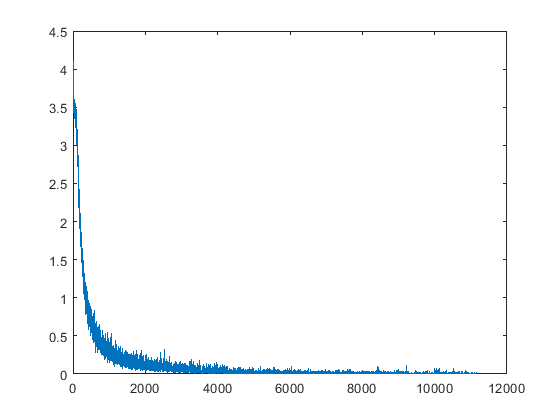

Figure 7: Variation of Cross Entropy

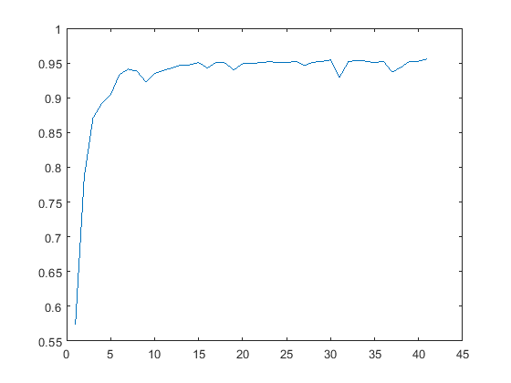

Figure 8: Variation of accuracy

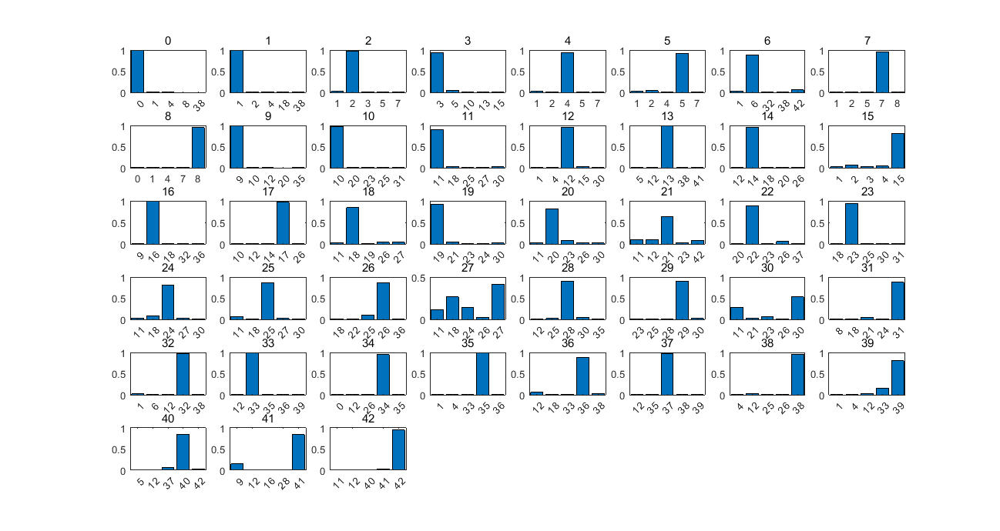

Figure 9: Average SoftMax for Every Class in Test Set

5.	Testing Model with Outside Images
The truth that the neural network remembers most of traffic signs from the training set does not mean it will recognize the traffic signs from another database. We choose five traffic signs (Figure 10) from the Internet whose average SoftMax is lowest in Figure 9. The nature network recognizes four of them, but a Class 24 successfully confuses the neural network (Figure 11). 

Figure 10: Chosen five most uncertain signs (Class 11, 18, 24, 27 and 30)

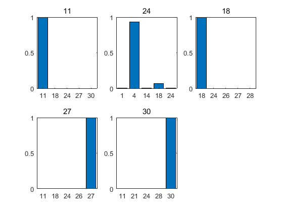

Figure 11: SoftMax Output for Five Chosen Figures. A Class 24 confuses the neural network.

6.	Discussion
The Tensorflow and MATLAB are powerful tools for machine learning. However, there lacks a mathematic explication that how many nerve cells should be used and why this structure is better than another. If we follow the instruction from the successful case, e.g. [10]. It is likely to have similar conclusion. But, a mathematic proven will certainly make the natural network more reliable. 

7.	Acknowledgements
The authors would like to thank the program [11] which can solve Minimum Boundary Circle problem.

References
[1]	Udacity, “Project: Build a Traffic Sign Recognition Program.” [Online]. Available: https://github.com/udacity/CarND-Traffic-Sign-Classifier-Project.
[2]	Google, “TensorFlow.” [Online]. Available: https://www.tensorflow.org/.
[3]	MathWorks, “MATLAB.” [Online]. Available: https://www.mathworks.com/.
[4]	“German Traffic Sign Dataset.” [Online]. Available: http://benchmark.ini.rub.de/?section=gtsrb&subsection=dataset.
[5]	Google, “tf.nn.softmax.” [Online]. Available: https://www.tensorflow.org/api_docs/python/tf/nn/softmax.
[6]	MathWorks, “Comparison of Auto White Balance Algorithms.” [Online]. Available: https://cn.mathworks.com/help/images/examples/comparison-of-auto-white-balance-algorithms.html.
[7]	MathWorks, “Image Segmentation Using the Image Segmenter App.” [Online]. Available: https://cn.mathworks.com/help/images/image-segmentation-using-the-image-segmenter-app.html.
[8]	MathWorks, “Marker-Controlled Watershed Segmentation.” [Online]. Available: https://cn.mathworks.com/help/images/examples/marker-controlled-watershed-segmentation.html.
[9]	“CarND-LeNet-Lab.” [Online]. Available: https://github.com/BlueBirdHouse/CarND-LeNet-Lab.
[10]	P. Sermanet and Y. LeCun, “Traffic sign recognition with multi-scale Convolutional Networks,” in The 2011 International Joint Conference on Neural Networks, 2011, pp. 2809–2813.
[11]	A. Semechko, “Exact minimum bounding spheres/circles.” [Online]. Available: https://cn.mathworks.com/matlabcentral/fileexchange/48725-exact-minimum-bounding-spheres-circles.

