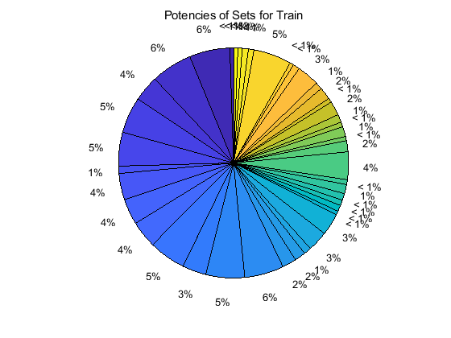

## Project: Build a Traffic Sign Recognition Program

1. 	Introduction

In this project assignment [1] of Udacity's self-driving car Nanodegree, Tensorflow [2] and MATLAB [3] are used together to build a convolutional neural network for classifying traffic signs of German Traffic Sign Dataset [4]. The accuracy on the validation set is 95.6%, and the test accuracy is 94.4%. Based on the output of Softmax [5] function, five most easily confused figures are chosen from the Internet. The neural network recognizes four but makes a serious mistake on one.

2.	Preprocessing Dataset

The figures of traffic sign that are provided by Udacity are unevenly distributed between different types (Figure 1). Train, valid and test sets have same problem, which will worsen the training. However, they cannot be balanced because it will lead small samples. 

Potencies of Sets for Train

